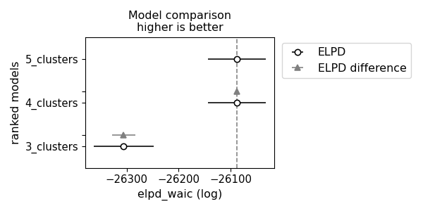

# DMM - Dirichlet Multinomial Mixture model


## Example Usage

In the example below we'll generate a synthetic dataset with 4 clusters, each with a different distribution of 5 species. 
We'll then fit the DMM model to the data and compare the WAIC scores for models with 3, 4 and 5 clusters to see which is 
optimal.

```python
from prodiphy import DMM
import numpy as np
import pandas as pd
from random import shuffle
from scipy.stats import dirichlet
import arviz as az
import matplotlib.pyplot as plt

if __name__ == "__main__":
    # create a synthetic dataset with 4 clusters
    data = []

    alphas = [[16,1,1,1,1],
              [1,4,4,10,1],
              [2,2,2,2,20],
              [1,10,1,10,1]]

    sample_count = [200,200,400,400]

    for i in range(4):
        alpha = alphas[i]
        for j in range(sample_count[i]):
            pvals = dirichlet.rvs(alpha, size=1)[0]
            data.append(np.random.multinomial(1000, pvals))

    shuffle(data)

    df = pd.DataFrame(data)

    models = {}
    for i in [3, 4, 5]:
        model = DMM(clusters=i, tune=1000, samples=500, chains=2, cores=2)
        model.fit(df, lower=10, upper=30)
        output = model.get_stats()

        models[f"{i}_clusters"] = model.trace

    comp_waic = az.compare(models, ic="waic")

    az.plot_compare(comp_waic)

    plt.tight_layout()
    plt.savefig("./tmp/example_4_waic.png")
```

The plot below shows the WAIC scores for models with 3, 4 and 5 clusters. While The model with 5 clusters has the 
lowest WAIC score, there is no difference between the models with 4 and 5 clusters. Hence, the model with 4 clusters is
preferred as it is simpler.



