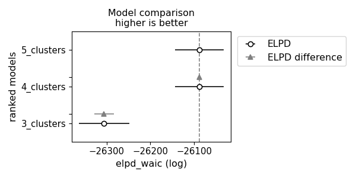

# DMM - Dirichlet Multinomial Mixture

A Dirichlet Multinomial Mixture (DMM) model is a probabilistic approach for clustering categorical data, such as word 
distributions in text documents or species abundances in biological samples. It extends the 
Dirichlet-multinomial distribution by incorporating a mixture model, allowing data points to be grouped into 
latent clusters, each with its own characteristic distribution. This enables the model to account for underlying 
population heterogeneity and better capture variations in observed categorical counts.

## Mathematical formulation

Assume there are $N$ samples, $K$ observed categories (features), and $C$ latent clusters.
For sample $i$, define the count vector

$$
\mathbf{x}_i = (x_{i1}, \dots, x_{iK})
$$
$$
n_i = \sum_{k=1}^{K} x_{ik}
$$

In the current implementation, a common read depth is used in the likelihood,

$$
n = \mathrm{median}_i(n_i)
$$

and each mixture component $c \in \{1,\dots,C\}$ has:

- mixture weight $w_c$
- category proportions:

$$
\mathbf{p}_c = (p_{c1},\dots,p_{cK}) \quad \sum_{k=1}^{K} p_{ck}=1
$$

- concentration (overdispersion) parameter $\alpha_c > 0$

The priors used by the model are:

$$
\mathbf{w} = (w_1,\dots,w_C) \sim \mathrm{Dirichlet}(\boldsymbol{\gamma})
$$
$$
\mathbf{p}_c \sim \mathrm{Dirichlet}(\boldsymbol{\beta})
$$
$$
\alpha_c \sim \mathrm{Uniform}(\text{lower},\text{upper})
$$

where by default $\boldsymbol{\gamma}$ is uniform over clusters and
$\boldsymbol{\beta}$ is set from the empirical mean composition in the input table.

For each cluster, the Dirichlet-Multinomial concentration vector is

$$
\mathbf{a}_c = \alpha_c\,\mathbf{p}_c
$$

Conditioned on cluster membership $z_i$, each sample follows:

$$
\mathbf{x}_i \mid z_i=c \sim \mathrm{DirichletMultinomial}(n, \mathbf{a}_c)
$$

Marginalizing over latent cluster assignments gives the mixture likelihood used in PyMC:

$$
p(\mathbf{x}_i \mid \Theta) = \sum_{c=1}^{C} w_c\,\mathrm{DM}(\mathbf{x}_i \mid n, \mathbf{a}_c)
$$

with parameter set

$$
\Theta = \{\mathbf{w},\mathbf{p}_{1:C},\alpha_{1:C}\}
$$

After posterior sampling, cluster assignment for each sample is obtained from posterior predictive draws of
the latent categorical index:

$$
\Pr(z_i=c \mid \mathbf{x}_i, \text{data}) \propto w_c\,\mathrm{DM}(\mathbf{x}_i \mid n, \mathbf{a}_c)
$$

and the reported cluster is the component with the highest posterior assignment probability.

## Example Usage

The DMM class can be used to fit a Dirichlet Multinomial Mixture model to a dataset and determine the optimal number of
clusters. Though, a single DMM model can also be used to fit a specific number of clusters and then assign data points
to one of those clusters.

### Determining the optimal number of clusters
In the example below we'll generate a synthetic dataset with 4 clusters, each with a different distribution of 5 species. 
We'll then fit the DMM model to the data and compare the WAIC scores for models with 3, 4 and 5 clusters to see which is 
optimal.

```python
from prodiphy import DMM
import numpy as np
import pandas as pd
from random import shuffle
from scipy.stats import dirichlet
import arviz as az
import matplotlib.pyplot as plt

if __name__ == "__main__":
    # create a synthetic dataset with 4 clusters
    data = []

    alphas = [[16,1,1,1,1],
              [1,4,4,10,1],
              [2,2,2,2,20],
              [1,10,1,10,1]]

    sample_count = [200,200,400,400]

    for i in range(4):
        alpha = alphas[i]
        for j in range(sample_count[i]):
            pvals = dirichlet.rvs(alpha, size=1)[0]
            data.append(np.random.multinomial(1000, pvals))

    shuffle(data)

    df = pd.DataFrame(data)

    # determine the optimal number of clusters (3, 4 or 5)
    clusters = [3, 4, 5]
    comps = DMM.determine_best_cluster_count(df, cluster_sizes=clusters, tune=1000, samples=500, chains=2, cores=2, lower=10, upper=30, ic="waic")

    az.plot_compare(comps)

    plt.tight_layout()
    plt.savefig("./example_waic.png")
```

The plot below shows the widely applicable information criterion (WAIC) scores for models with 3, 4 and 5 clusters. While The model with 5 clusters has the 
lowest WAIC score, there is no difference between the models with 4 and 5 clusters. Hence, the model with 4 clusters is
preferred as it is simpler.



### Assigning data points to clusters

Here we'll fit a 3-cluster DMM model to a synthetic dataset and assign each data point to one of the clusters.

```python
from prodiphy import DMM
import numpy as np
import pandas as pd
from random import shuffle
from scipy.stats import dirichlet

if __name__ == "__main__":
    # create a synthetic dataset with 3 clusters
    data = []

    alphas = [[16,1,1,1,1],
              [1,4,4,10,1],
              [2,2,2,2,20]]

    sample_count = [200,200,400]

    for i in range(3):
        alpha = alphas[i]
        for j in range(sample_count[i]):
            pvals = dirichlet.rvs(alpha, size=1)[0]
            data.append(np.random.multinomial(1000, pvals))

    shuffle(data)

    df = pd.DataFrame(data)

    model = DMM(clusters=3, tune=500, samples=500, chains=2, cores=2)
    model.fit(df, lower=10, upper=30)
    output = model.get_stats()


    clusters = model.get_clusters(df)
    
    output.to_excel(f"./example_output.xlsx")
    clusters.to_excel(f"./example_clusters.xlsx")

```

This will create two Excel files: `example_output.xlsx` will contain the parameters of the model and
`example_clusters.xlsx` will assign each data point to one of the clusters.

